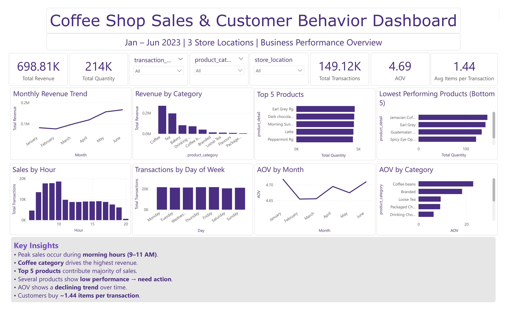

# ☕ Coffee Shop Sales Analysis

## 📌 Project Overview
This project analyzes coffee shop sales data using Microsoft Excel. The objective is to identify sales trends, customer purchasing behavior, peak business hours, and product performance through an interactive dashboard.

## 🎯 Business Problem
Coffee shop owners need insights into:
- Total sales performance
- Customer footfall trends
- Best-selling products
- Peak sales hours
- Store-wise performance

This dashboard helps transform raw sales data into actionable business insights.

## 🛠 Tools Used
- Microsoft Excel
- Pivot Tables
- Pivot Charts
- Slicers
- Dashboard Design

## 📊 Key Metrics
- Total Sales
- Total Orders
- Total Footfall
- Average Bill per Person
- Average Orders per Person

## 📈 Dashboard Insights

### Sales Analysis
- Identifies overall revenue performance.
- Tracks monthly and daily sales trends.

### Peak Hours Analysis
- Highlights the busiest hours of the day.
- Helps optimize staffing and operations.

### Product Performance
- Shows top-selling products.
- Helps identify customer preferences.

### Store Performance
- Compares sales across different store locations.
- Assists in evaluating branch performance.

## 📷 Dashboard Preview

## 🚀 Key Learnings
- Data Cleaning in Excel
- Creating Pivot Tables and Charts
- Interactive Dashboard Design
- Business Insight Generation
- KPI Tracking and Reporting

## 📁 Project Structure

coffee-shop-sales-analysis/

├── Coffee Shop Sales .ipynb
├── Coffee_sales Query.sql
├── Coffee_Sales.png
└── README.md

## 📬 Contact

**Ananya Varshney**  
Aspiring Data Analyst | Excel | SQL | Power BI | Python

GitHub: https://github.com/Ananyavarshney-Analytics
